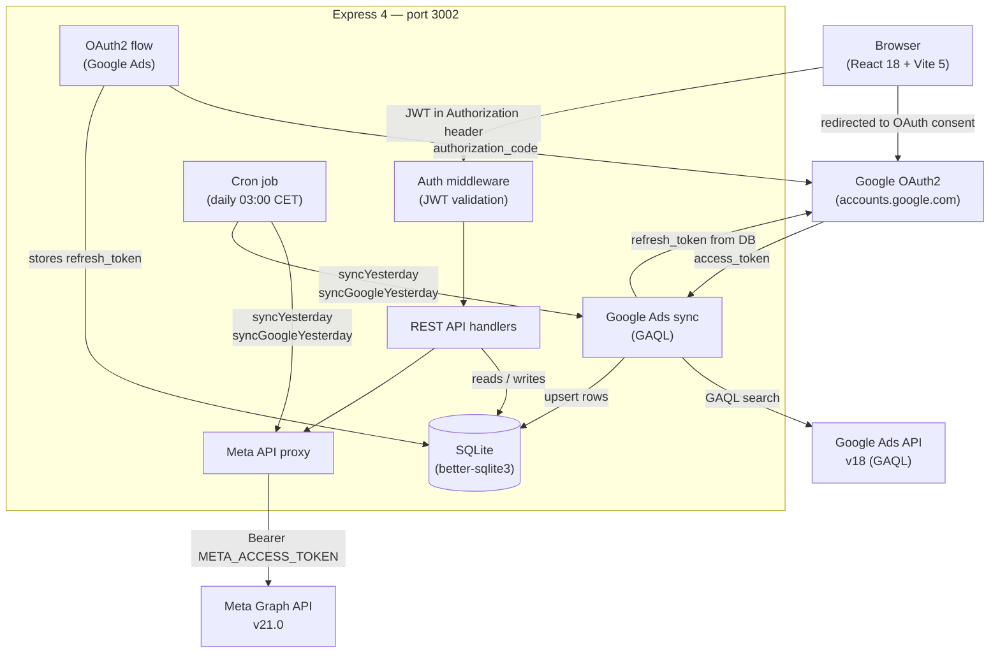
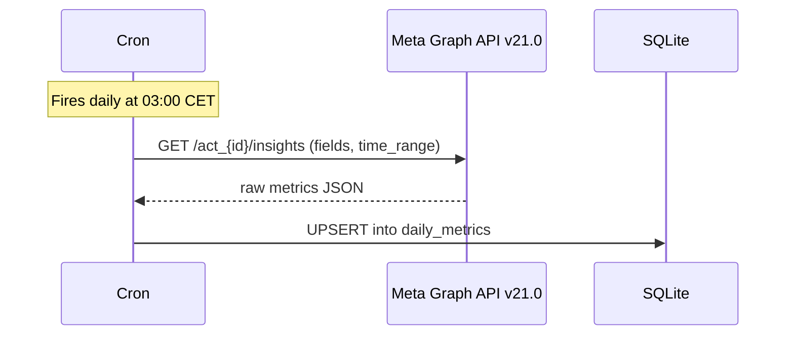
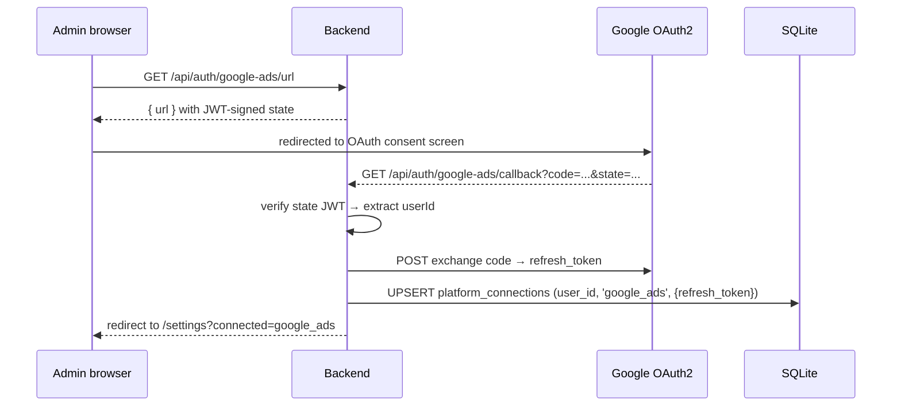
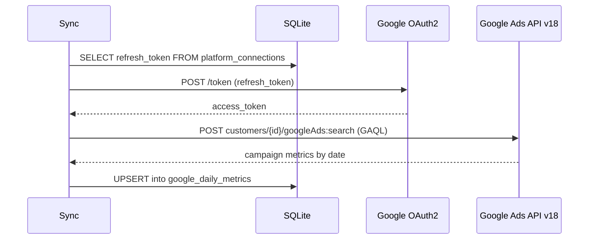

# Architecture

## System Overview

meta-dashboard is an internal advertising reporting tool for agency .eliteagency. It supports two ad platforms: **Meta Ads** (via system token) and **Google Ads** (via per-admin OAuth2). The frontend is a React 18 SPA served by Vite in development and from `dist/` in production. The backend is an Express 4 server that owns all platform API communication, OAuth flows, and the local SQLite database. The browser never holds a platform access token.

```
Production server: /opt/meta-dashboard   (Hetzner VPS)
Backend port:      3002
nginx prefix:      /meta/
PM2 process:       meta-dashboard
```

---

## High-Level Diagram



---

## Data Flows

### Auth Flow

1. Client sends `POST /api/auth/login` with `{ email, password }`
2. Server looks up user, verifies password with bcrypt
3. On success, JWT is signed with `JWT_SECRET` (30-day expiry) and returned
4. All subsequent requests include JWT in `Authorization: Bearer` header
5. `authMiddleware` validates token and attaches `{ userId, role }` to request
6. Viewer-role requests are filtered via `user_accounts` (Meta) or `user_google_accounts` (Google Ads)

### Meta Sync Flow



Token source: `META_ACCESS_TOKEN` environment variable (system user token — never expires).

### Google Ads OAuth Flow



### Google Ads Sync Flow



Quartile values (video_p25–p100) are stored as impression-weighted percentages aggregated from campaign level.

---

## Database Schema

### Meta Ads

| Table | Key columns |
|---|---|
| `accounts` | id (act_xxx), name, currency, synced_at |
| `daily_metrics` | account_id, date, spend, impressions, reach, clicks, unique_clicks, outbound_clicks, leads, calls, purchase_value |
| `users` | id, email, password_hash, role (admin/viewer), active |
| `user_accounts` | user_id, account_id — access control join table |

### Google Ads

| Table | Key columns |
|---|---|
| `google_accounts` | id (customer_id), name, currency, synced_at |
| `google_daily_metrics` | account_id, date, spend, impressions, clicks, conversions, video_views, video_impressions, video_p25/p50/p75/p100 |
| `user_google_accounts` | user_id, account_id — access control join table |

### Shared

| Table | Key columns |
|---|---|
| `platform_connections` | id, user_id, platform ('google_ads'), config (JSON with refresh_token), connected_at |
| `clients` | id, name, created_at |
| `client_accounts` | client_id, platform, account_id — many-to-many |

Derived KPIs (CPM, CPC, CTR, CPL, CVR, ROAS, cost_per_conversion) are not stored — computed on every aggregate read.

---

## API Reference

### Auth

| Method | Path | Auth | Description |
|---|---|---|---|
| POST | `/api/auth/login` | None | Exchange credentials for JWT |
| GET | `/api/auth/me` | JWT | Current user info |
| GET | `/api/auth/connections` | JWT | Platform connection status |
| GET | `/api/auth/google-ads/url` | Admin | Generate Google OAuth URL |
| GET | `/api/auth/google-ads/callback` | None (OAuth) | Handle Google OAuth callback |
| DELETE | `/api/auth/google-ads` | Admin | Disconnect Google Ads |

### Meta Ads

| Method | Path | Auth | Description |
|---|---|---|---|
| GET | `/api/db/accounts` | JWT | List accessible Meta accounts |
| GET | `/api/db/metrics/:accountId` | JWT | Daily metrics for date range |
| GET | `/api/db/aggregate/:accountId` | JWT | Aggregated KPIs + computed metrics |
| POST | `/api/db/sync` | Admin | Trigger manual Meta sync |
| ALL | `/api/meta/*` | JWT | Proxied Meta Graph API calls |

### Google Ads

| Method | Path | Auth | Description |
|---|---|---|---|
| GET | `/api/gads/accounts` | JWT | List accessible Google Ads accounts |
| GET | `/api/gads/metrics/:accountId` | JWT | Daily metrics for date range |
| GET | `/api/gads/aggregate/:accountId` | JWT | Aggregated KPIs + video quartiles |
| POST | `/api/gads/sync` | Admin | Trigger manual Google Ads sync |

### Clients & Users

| Method | Path | Auth | Description |
|---|---|---|---|
| GET | `/api/clients` | Admin | List all clients with accounts |
| POST | `/api/clients` | Admin | Create client |
| PUT | `/api/clients/:id` | Admin | Update client name/accounts |
| DELETE | `/api/clients/:id` | Admin | Delete client |
| GET | `/api/users` | Admin | List users |
| POST | `/api/users` | Admin | Create user |
| PUT | `/api/users/:id` | Admin | Update user |
| DELETE | `/api/users/:id` | Admin | Delete user |

---

## Frontend Component Overview

| Component | Purpose |
|---|---|
| `Navigation` | Top nav: logo (→ dashboard), admin dropdown, account selector, date range, sync |
| `DashboardPage` | Platform switcher (Meta / Google Ads), routes to sub-dashboards |
| `MetaDashboard` | Meta metrics grid, performance chart, targeting analysis, ad cards, video cards |
| `GoogleAdsDashboard` | Google metrics grid, performance chart, video section |
| `GoogleVideoSection` | Video views card + quartile retention bars (Google branding) |
| `MetricCard` | Single KPI tile |
| `PerformanceChart` | Daily trend chart (Recharts) |
| `TargetingAnalysis` | Age/region breakdowns — Meta only |
| `AdCards` | Horizontal creative cards with pagination — Meta only |
| `VideoCards` | Per-creative video retention with quartile bars — Meta only |
| `ClientsPage` | Client CRUD with account assignment modal |
| `UsersPage` | User management (create/edit/delete, account assignment) |
| `SettingsPage` | Platform connection status, Google Ads connect/disconnect |

---

## Decision Log

### Meta: system token vs. OAuth

Meta integration uses a **System User token** (`META_ACCESS_TOKEN` in `.env`) that never expires, rather than a per-user OAuth flow. This is appropriate for an agency managing client accounts from a single MCC-equivalent setup — the token holds the necessary permissions for all ad accounts, and there is no need for end-users to grant access individually.

### Google Ads: per-admin OAuth

Google Ads requires OAuth2 with the `adwords` scope. Unlike Meta, Google does not offer non-expiring system tokens for Ads API. The refresh token is stored in the `platform_connections` table tied to the admin user who authorized it, rather than hardcoded in `.env`. This means token rotation is handled in the database rather than requiring a server restart.

### OAuth state as signed JWT

The OAuth `state` parameter (passed through the Google OAuth redirect) is a short-lived JWT signed with `JWT_SECRET`, containing `{ userId, purpose: 'gads_oauth' }`. This ties the callback back to the specific admin who initiated the flow, preventing CSRF and account-swapping attacks, without requiring server-side session storage.

### SQLite over direct API calls per request

The Meta/Google Ads APIs enforce rate limits. Fetching metrics on every page load would exhaust limits across multiple users and add 500–2000 ms latency. SQLite means dashboard loads are served from local disk (sub-millisecond), and API calls are limited to one scheduled sync per day plus on-demand admin triggers.

### Server-side tokens

Embedding access tokens in the frontend bundle or passing them through client requests would expose long-lived, high-privilege credentials in browser devtools. All platform communication is routed through the backend — the browser never holds a token.

### JWT over server-side sessions

The dashboard runs as a single Node process with no shared session store. JWTs are stateless, require no additional infrastructure, and work naturally with the existing Express setup. 30-day expiry matches agency staff usage patterns.
